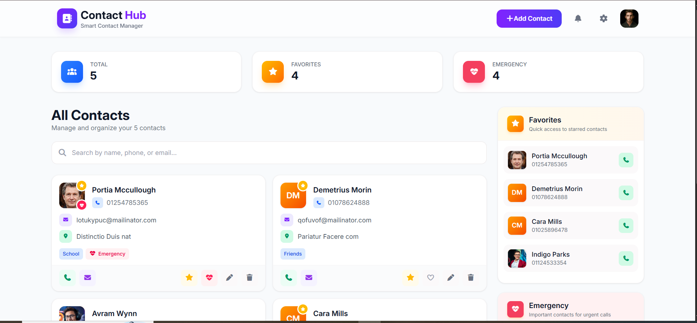

<div align="center">

# 📇 Contact Hub

### Smart Contact Manager Web App

A clean and interactive contact management website that helps users add, organize, search, update, and manage contacts easily.

[](https://nada-mahrous.github.io/Contact-Hub/)
[](https://github.com/nada-mahrous/Contact-Hub)

</div>

---

## 📸 Preview



---

## ✨ Highlights

- Add new contacts with full details
- Upload and display contact images
- Show initials automatically when no image is available
- Mark contacts as favorites
- Mark contacts as emergency contacts
- Edit and update saved contacts
- Delete contacts with confirmation alert
- Search contacts dynamically
- Save data using Local Storage
- Responsive and clean user interface

---

## 🛠️ Tech Stack

- HTML5
- CSS3
- Bootstrap
- JavaScript
- Font Awesome
- SweetAlert2
- Local Storage

---

## 🚀 Live Demo

<div align="center">

[🔗 View Live Website](https://nada-mahrous.github.io/Contact-Hub/)

</div>

---

## 📌 Features

### 👤 Contact Management
Users can add contacts with name, phone number, email, address, group, notes, and image.

### ⭐ Favorites
Users can mark important contacts as favorites for quick access.

### 🚨 Emergency Contacts
Users can mark contacts as emergency contacts for urgent calls.

### 🔍 Search Functionality
Contacts can be searched dynamically by name or related information.

### 🖼️ Smart Avatar
If a contact image is not available, the app automatically displays the initials of the contact name.

### 💾 Local Storage
All contacts are saved in the browser, so data remains available after page reload.

---

## 📂 Project Structure

```bash
Contact-Hub/
│
├── index.html
├── css/
│   └── style.css
├── js/
│   └── main.js
├── imgs/
│   └── project images
└── README.md
